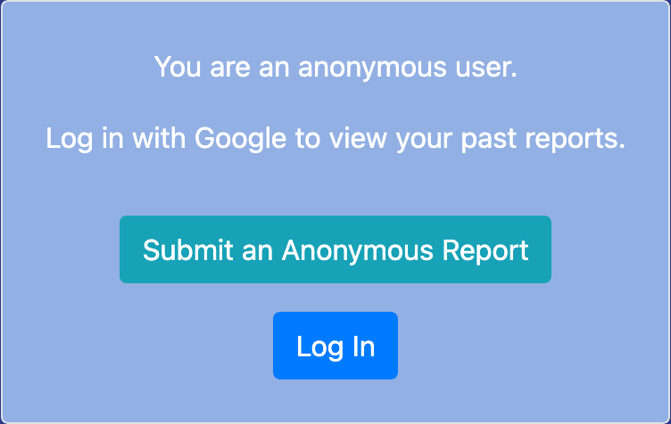
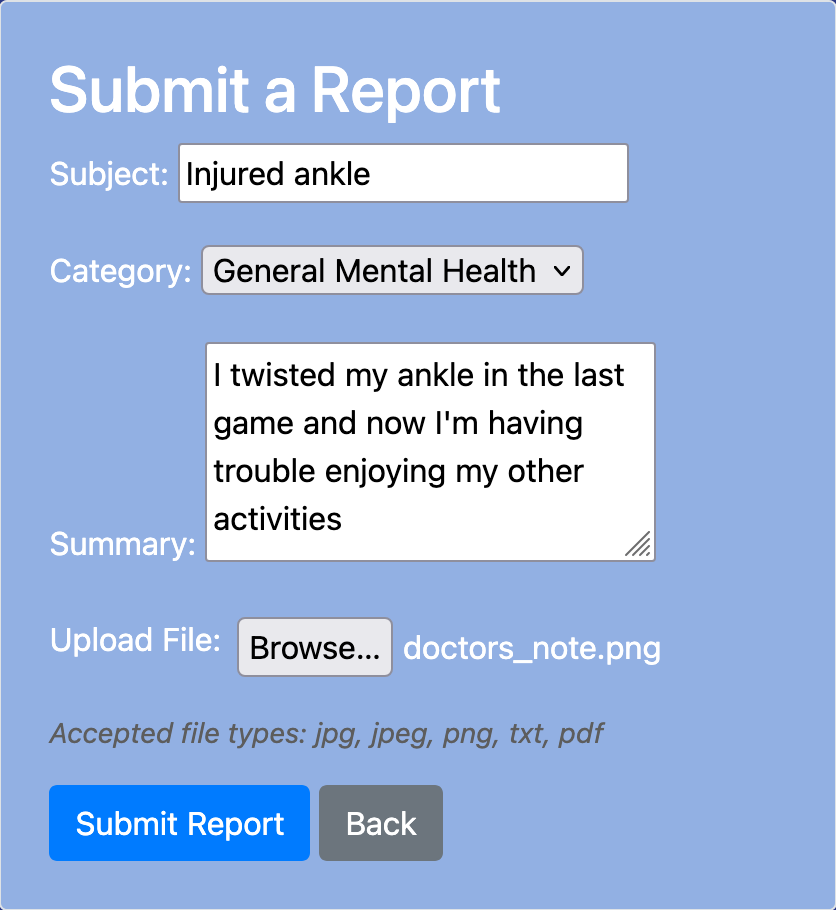
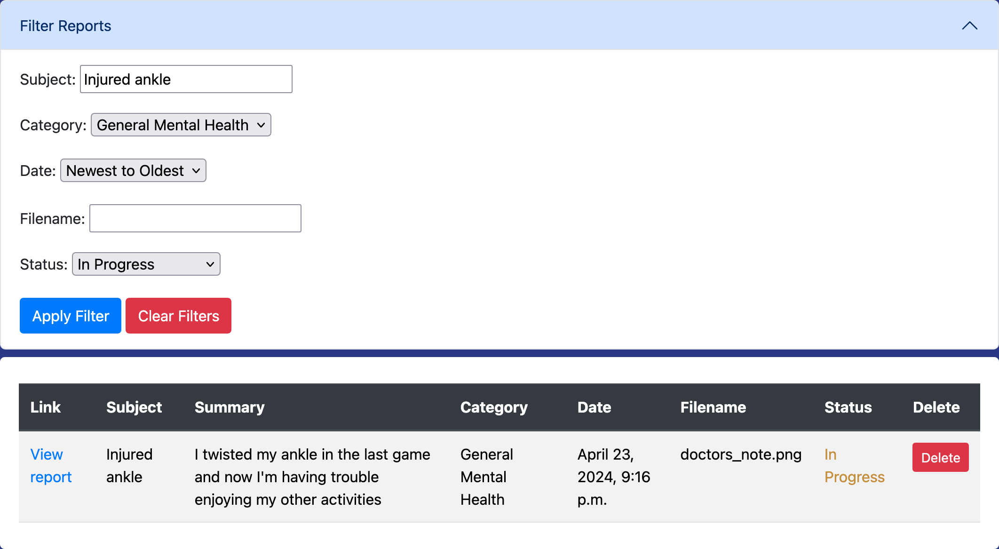
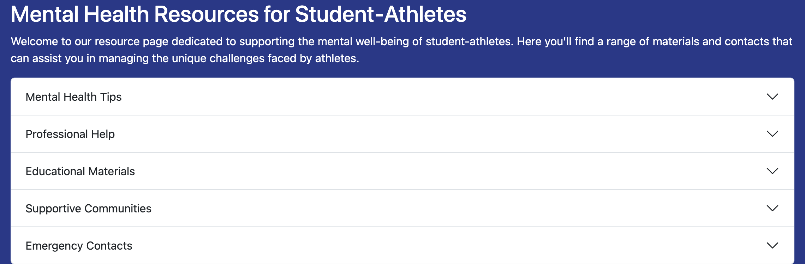
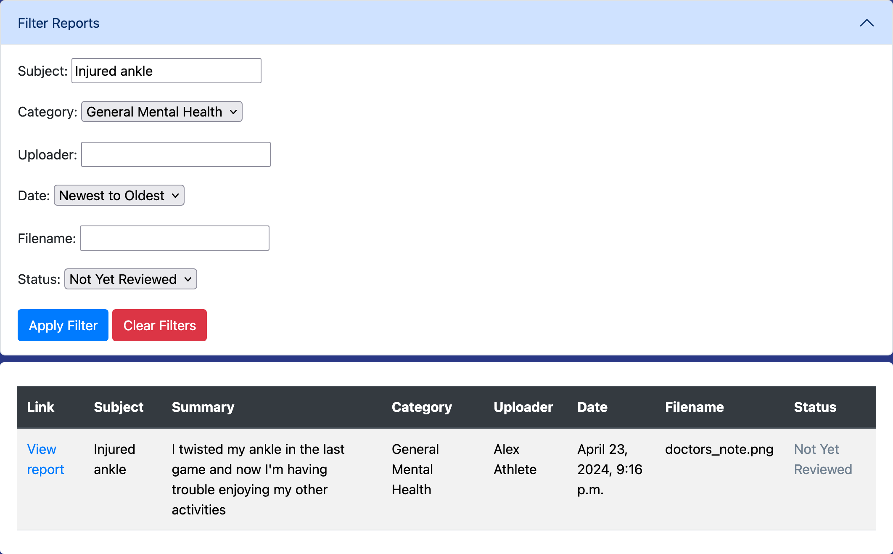
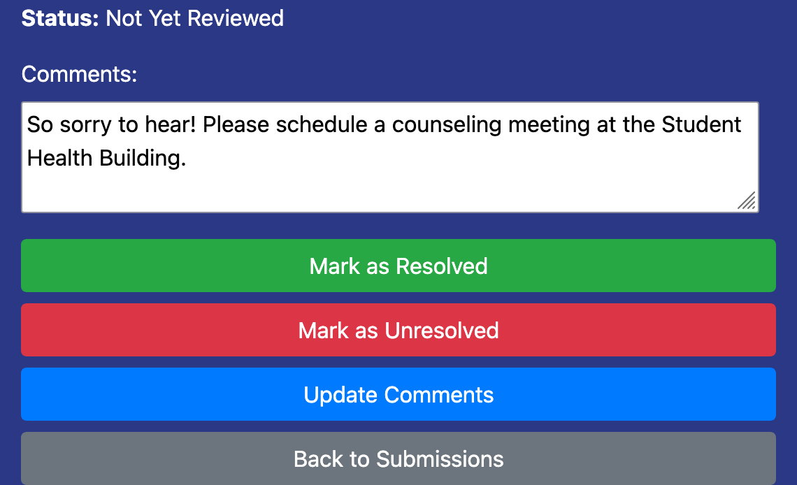

# Whistleblower Website

## Description

Report an Athlete is a web application that helps student athletes privately report physical or mental health problems about themselves or their peers privately and securely.

This project was created for CS 3240 (Advanced Software Development), Spring 2024, at UVA. Throughout the course, we learned about the steps of the software development lifecycle while we worked on our project. The app was built with the Django framework and integrates Google OAuth login and Amazon S3 storage. The completed version was previously deployed to [Heroku](https://www.heroku.com/).

## My Contributions

I worked with 4 other students using the scrum process to complete the project in several sprints. Each member contributed equally to the development and held a different team role. I chose to serve as the Software Architect because I enjoy methodically planning out projects and seeing how components interact with each other.

As the Software Architect, I guided my team through a requirements change in the middle of the semester and drew class diagrams and flowcharts for new features. As an experienced programmer, I also provided technical support, such as creating initial GitHub pull requests and CI actions and debugging Heroku and Python errors. Lastly, as a group member, I assisted in implementing features, namely creating models for site users and file uploads and creating the filterable table for viewing reports.

## Prerequisites

For the best compatibility, use [Python 3.12+](https://www.python.org/downloads/), and [PostgreSQL 15+](https://www.postgresql.org/download/).

You will need a [Google OAuth key](https://console.developers.google.com/), an [Amazon AWS account](https://aws.amazon.com/s3/), and a PostgreSQL database. Note that current students with GitHub Pro accounts can receive free credits for Heroku and Amazon S3, which are normally paid services. Heroku will provide you with a database instance and credentials.

## Running Locally

To see how to deploy a Django app in Docker, see my [Encyclosaurus](https://github.com/qgt7zm/encyclosaurus) repository.

1. *(Optional)* Create a virtual environment through an IDE or using `python3 -m venv .venv`.
    - You may need to activate the virtual environment using `source .venv/bin/activate` (Unix) or `.venv\Scripts\activate` (Windows).
2. Install the packages using `pip3 install -r requirements.txt`.
3. Create a copy of [.env.blank](.env.blank) named **.env** and fill in your secret keys.
    - You can generate a Django secret key using `python3 gen_key.py`.
4. Migrate your database using `python3 manage.py migrate`.
5. Run the app using `python3 manage.py runserver 8000`.
6. Visit the development server at http://127.0.0.1:8000/.

## Deploying to Production

Make sure not to include any secret keys in your repository!

1. Create GitHub repository secrets for each field in **.env**.
2. Move [django.yml](django.yml) to **.github/workflows** to enable continuous deployment after each passing build.
3. Fill out the environment variables on the hosting server and set `DEBUG` to `False`.
4. Run `python3 manage.py collectstatic` to collect static files into a single folder.
5. Upload the static files folder to the hosting server.

## Screenshots

### Users

Log in to track your reports or remain anonymous.

Submit a report and attach relevant files.

Check back to see the status of your reports.

Access mental health resources directly from the website.

### Admins

Log in to filter user reports.

Review user submissions and provide comments.

## Data Disclaimer

This project was created for a university course to learn how to develop software in a group. As such, no real names, photos, cases, or other data will be uploaded to this repository. Any examples bearing resemblance to real-life data are purely coincidental and unintentional.

## Licensing

This code is released under the permissive BSD-3 license (the same as Django's). If you wish to consult this repository for your own academic project, you should also contact your instructors regarding their plagiarism policy.
